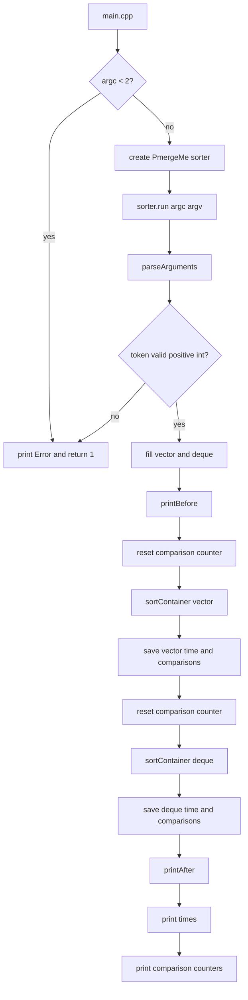
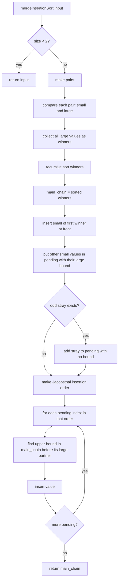

# PmergeMe Explained

Had file kaychra7 النسخة الجديدة:

- `PmergeMe.hpp`
- `PmergeMe.cpp`
- `main.cpp`
- `Makefile`

Build:

```sh
make re
./PmergeMe 3 5 9 7 4
```

Clean:

```sh
make fclean
```

## Subject Summary

CPP09 ex02 kayطلب program اسمو `PmergeMe` kayakhod sequence ديال positive integers من command line, kay-sortihom باستعمال merge-insertion sort المعروف ب Ford-Johnson, وكيقارن الوقت بين `std::vector` و `std::deque`.

Output expected normally fih:

- `Before:` sequence before sorting.
- `After:` sequence after sorting.
- time with `std::vector`.
- time with `std::deque`.

Ana زدتها كذلك:

- comparison counter for `std::vector`.
- comparison counter for `std::deque`.

## Big Idea

Ford-Johnson / merge-insertion sort kaynقص عدد المقارنات مقارنة ب sorting عادي:

1. Kanqsmou input l pairs.
2. Fkol pair kanعرفو `small` و `large` بمقارنة وحدة.
3. Kan-sortiw غير `large` values recursively.
4. Kanbniw `main_chain` من sorted large values.
5. `small` values kayb9aw f `pending`.
6. Kandkhlo `pending` f `main_chain` باستعمال binary insertion.
7. Order ديال insertion kayji من Jacobsthal باش search windows يبقاو قريبين من sizes بحال `2^k - 1`.

## Flowchart



## Ford-Johnson Flow



## Jacobsthal Insertion Order

Jacobsthal sequence:

```txt
J(0)=0
J(1)=1
J(n)=J(n-1)+2*J(n-2)
```

Values:

```txt
0, 1, 1, 3, 5, 11, 21, ...
```

For pending elements indexed from 1:

```txt
1, 3, 2, 5, 4, 11, 10, 9, 8, 7, 6, ...
```

In code we store indexes from 0, so we push `index - 1`.

Why this order? Binary insertion costs the same number of comparisons for ranges up to sizes:

```txt
1, 3, 7, 15, 31, ...
```

Jacobsthal order tries to insert elements when their search bound is inside those efficient sizes.

## File: main.cpp

Lines 1-4:

- include class header.
- include `exception` and `iostream` for try/catch and error output.

Lines 6-10:

- program starts.
- if no arguments are passed, print `Error` and return `1`.

Lines 11-15:

- create `PmergeMe sorter`.
- call `sorter.run(argc, argv)`.
- all real work starts from `run`.

Lines 15-18:

- catch any exception.
- print only `Error`, subject-style.
- return `1`.

Line 19:

- return `0` if everything worked.

## File: Makefile

Line 1:

- executable name is `PmergeMe`.

Line 2:

- compiler is `c++`.

Line 3:

- flags are `-Wall -Wextra -Werror -std=c++98`.

Line 4:

- source files are `main.cpp` and `PmergeMe.cpp`.

Line 5:

- object files are generated by replacing `.cpp` with `.o`.

Lines 7-10:

- `make` builds object files, then links them into `PmergeMe`.

Lines 12-16:

- `clean` removes objects.
- `fclean` removes objects and executable.

Lines 18-20:

- `re` rebuilds from zero.
- `.PHONY` marks Makefile rules that are not real files.

## File: PmergeMe.hpp

Line 1:

- `#pragma once` prevents double include.

Lines 3-7:

- required headers for time, deque, output, strings, and vector.

Line 9:

- class declaration starts.

Lines 10-16:

- public canonical form and public method `run`.
- `run` is the entry point used by `main.cpp`.

Lines 18-25:

- `Element` stores:
- `value`: real integer value.
- `id`: stable original id.
- `id` is important because duplicates can exist. Example: `4 4` needs two separate elements.

Lines 27-32:

- `Pair` stores one `small` and one `large`.
- constructor receives two elements and puts them in correct order.

Lines 34-41:

- `Pending` stores one value waiting to be inserted.
- `bound_id` says: insert this pending value only before its paired `large`.
- `has_bound == false` is used for odd stray element because it has no pair.

Lines 43-44:

- original values are stored twice:
- `_vector_data` for vector timing.
- `_deque_data` for deque timing.

Line 46:

- static comparison counter shared by the class.

Lines 48-52:

- helper methods for parsing and printing.

Lines 54-58:

- static algorithm helpers:
- parse one positive integer.
- compare two `Element`.
- compute Jacobsthal.
- reset and read comparison counter.

Lines 60-63:

- convert vector/deque of ints into vector of `Element`.
- build Jacobsthal insertion order.
- main Ford-Johnson function.

Lines 65-66:

- templated `sortContainer` works with both vector and deque.

Lines 68-73:

- find a value by id inside `main_chain`.
- custom binary upper bound using our `less` function.

Lines 76-83:

- implementation of `sortContainer`.
- convert container to `Element`.
- call `mergeInsertionSort`.
- copy sorted values back into the original container.

## File: PmergeMe.cpp

Line 1:

- include class declaration.

Lines 3-9:

- implementation headers:
- `algorithm` for `std::swap`.
- `cerrno`, `climits`, `cstdlib` for safe integer parsing.
- `iomanip` for fixed precision timing.
- `sstream` for tokenizing arguments.
- `stdexcept` for throwing errors.

Line 11:

- initializes static comparison counter to zero.

Lines 13-15:

- `Element` constructors.
- default constructor is useful for declaring temporary `stray`.

Lines 17-22:

- `Pair` constructor.
- starts with `small = first`, `large = second`.
- calls `less(large, small)`.
- if true, swap them.
- this is one comparison per pair and it is counted.

Lines 24-32:

- `Pending` constructors.
- first constructor is for normal pending values that have a paired `large` bound.
- second constructor is for odd stray values with no bound.

Lines 34-48:

- canonical form:
- default constructor.
- copy constructor.
- assignment operator.
- destructor.

Lines 50-77:

- `run` is the full program flow.
- parse input.
- print before.
- reset comparison counter.
- sort vector and store vector time/count.
- reset comparison counter again.
- sort deque and store deque time/count.
- print after.
- print timings.
- print comparison counts.

Lines 79-95:

- `parseArguments`.
- loop through `argv`.
- `istringstream` allows both styles:
- `./PmergeMe 3 5 1`
- `./PmergeMe "3 5 1"`
- each token is parsed as positive integer.
- value is pushed into both containers.
- if nothing was parsed, throw `Error`.

Lines 97-109:

- print original vector before sorting.
- print sorted vector after sorting.

Lines 111-120:

- print time and comparisons.
- time is converted from clock ticks to microseconds.

Lines 122-139:

- `parsePositiveInteger`.
- rejects empty token.
- accepts optional leading `+`.
- rejects non-digits.
- uses `strtol`.
- rejects overflow, zero, and negative values.
- returns valid `int`.

Lines 141-146:

- `less` is the only algorithm comparison function.
- every call increments `_comparison_count`.
- compare by value first.
- if values are equal, compare by id to keep duplicate elements stable and distinct.

Lines 148-154:

- reset and get comparison counter.

Lines 156-169:

- iterative Jacobsthal function.
- avoids recursion.
- formula: `J(n)=J(n-1)+2*J(n-2)`.

Lines 171-189:

- `makeElements` overloads.
- one works from vector.
- one works from deque.
- each integer becomes `Element(value, id)`.

Lines 191-223:

- `makeInsertionOrder`.
- if pending list is empty, return empty order.
- start with Jacobsthal index 3 because `J(3)=3`.
- each group inserts pending indexes backwards.
- example for pending size 6:

```txt
pending 1-based order: 1, 3, 2, 5, 4, 6
stored 0-based order:  0, 2, 1, 4, 3, 5
```

- `current - 1` is used because group ends before current Jacobsthal boundary.
- indexes are stored zero-based for C++ vectors.

Lines 225-276:

- `mergeInsertionSort`, the real Ford-Johnson function.

Lines 236-237:

- base case.
- size 0 or 1 is already sorted.

Lines 238-244:

- reserve space.
- pair elements two by two.
- each pair constructor puts small/large in order.
- collect all `large` values into `winners`.

Lines 245-246:

- if input size is odd, keep last unpaired element as `stray`.

Lines 247-250:

- recursively sort only `winners`.
- `main_chain` starts as sorted winners.

Lines 251-261:

- for each sorted winner, find its original pair.
- if it is the first winner, insert its small partner at the front.
- reason: first small is guaranteed to be before first large.
- other small partners go to `pending`, with their large partner as bound.

Lines 262-263:

- odd stray has no bound, so it is added as pending without bound.

Lines 264-274:

- create Jacobsthal insertion order.
- for each pending value in that order:
- if it has bound, find the paired large inside `main_chain`.
- binary-search only from begin to that bound.
- insert at returned position.

Line 275:

- return fully sorted chain.

Lines 278-285:

- `findById`.
- scans `main_chain` until it finds the element with given id.
- returns `end()` if not found.

Lines 287-310:

- custom `upperBound`.
- same idea as `std::upper_bound`, but uses our `less`.
- this lets the comparison counter count binary-search comparisons.
- returns the first position after all values less than or equal to `value`.

## Example Walkthrough

Input:

```txt
3 5 9 7 4
```

Pairing:

```txt
(3,5) => small 3, large 5
(9,7) => small 7, large 9
stray => 4
```

Winners:

```txt
5 9
```

Sorted winners:

```txt
5 9
```

Main chain starts:

```txt
5 9
```

Insert first small at front:

```txt
3 5 9
```

Pending:

```txt
7 bound before 9
4 no bound
```

Jacobsthal order for two pending values:

```txt
1, 2
```

Insert `7` before bound `9`:

```txt
3 5 7 9
```

Insert stray `4` in whole chain:

```txt
3 4 5 7 9
```

## Output Example

```txt
Before: 3 5 9 7 4
After: 3 4 5 7 9
Time to process a range of 5 elements with std::vector : 7.00000 us
Time to process a range of 5 elements with std::deque : 4.00000 us
Comparisons made with std::vector : 7
Comparisons made with std::deque : 7
```

## Notes

- This version allows duplicate values because `Element` has `id`.
- It rejects `0`, negative values, overflow, and invalid tokens.
- The comparison counter counts calls to `less`.
- `findById` comparisons are not counted because they are not value comparisons from the sorting algorithm. They are only bookkeeping to find the paired bound.

## Full Walkthrough With 23 Numbers

Example input:

```txt
17 3 42 8 29 11 5 37 23 1 19 31 7 13 2 41 34 6 27 15 9 25 21
```

Sorted result should be:

```txt
1 2 3 5 6 7 8 9 11 13 15 17 19 21 23 25 27 29 31 34 37 41 42
```

### Step 1: Give Every Value An Id

The code converts each int into `Element(value, id)`.

```txt
17#0  3#1   42#2  8#3   29#4  11#5  5#6   37#7
23#8  1#9   19#10 31#11 7#12  13#13 2#14  41#15
34#16 6#17  27#18 15#19 9#20  25#21 21#22
```

The `#id` part is not printed by the program. It exists only inside the code so duplicate values can still be treated as different elements.

### Step 2: Pair The Input

The algorithm reads two values at a time. Each pair becomes `(small, large)`.

```txt
(17#0, 3#1)    => small 3#1,   large 17#0
(42#2, 8#3)    => small 8#3,   large 42#2
(29#4, 11#5)   => small 11#5,  large 29#4
(5#6, 37#7)    => small 5#6,   large 37#7
(23#8, 1#9)    => small 1#9,   large 23#8
(19#10, 31#11) => small 19#10, large 31#11
(7#12, 13#13)  => small 7#12,  large 13#13
(2#14, 41#15)  => small 2#14,  large 41#15
(34#16, 6#17)  => small 6#17,  large 34#16
(27#18, 15#19) => small 15#19, large 27#18
(9#20, 25#21)  => small 9#20,  large 25#21
stray           => 21#22
```

Because 23 is odd, the last value `21#22` has no pair. The code calls it `stray`.

### Step 3: Winners And Pending Values

The `large` values are called winners:

```txt
17#0 42#2 29#4 37#7 23#8 31#11 13#13 41#15 34#16 27#18 25#21
```

The `small` values wait in pending:

```txt
3#1 8#3 11#5 5#6 1#9 19#10 7#12 2#14 6#17 15#19 9#20
```

The stray also waits in pending:

```txt
21#22
```

But before pending insertion, the winners must be sorted recursively.

### Step 4: Recursive Sort Of Winners

Now the algorithm sorts only:

```txt
17 42 29 37 23 31 13 41 34 27 25
```

This is the same process again.

Pair winners:

```txt
(17, 42) => small 17, large 42
(29, 37) => small 29, large 37
(23, 31) => small 23, large 31
(13, 41) => small 13, large 41
(34, 27) => small 27, large 34
stray     => 25
```

Winners of winners:

```txt
42 37 31 41 34
```

Those are sorted recursively again and become:

```txt
31 34 37 41 42
```

Then the waiting values from this level are inserted:

```txt
17 bound before 42
29 bound before 37
23 bound before 31
13 bound before 41
27 bound before 34
25 no bound
```

After this recursive level finishes, the sorted winners from Step 3 are:

```txt
13#13 17#0 23#8 25#21 27#18 29#4 31#11 34#16 37#7 41#15 42#2
```

That sorted list becomes the first `main_chain` for the full 23-number input.

### Step 5: Build Main Chain At Top Level

Start:

```txt
main_chain:
13#13 17#0 23#8 25#21 27#18 29#4 31#11 34#16 37#7 41#15 42#2
```

The first winner is `13#13`. Its small partner was `7#12`.

The code inserts that first small at the front:

```txt
main_chain:
7#12 13#13 17#0 23#8 25#21 27#18 29#4 31#11 34#16 37#7 41#15 42#2
```

Why is this allowed? Because `7#12 < 13#13`, and `13#13` is the smallest winner in the sorted winner chain.

### Step 6: Build Pending Chain At Top Level

All other small values go to pending. Each one remembers its paired large as a search bound.

```txt
pending index 1:  3#1   bound before 17#0
pending index 2:  1#9   bound before 23#8
pending index 3:  9#20  bound before 25#21
pending index 4:  15#19 bound before 27#18
pending index 5:  11#5  bound before 29#4
pending index 6:  19#10 bound before 31#11
pending index 7:  6#17  bound before 34#16
pending index 8:  5#6   bound before 37#7
pending index 9:  2#14  bound before 41#15
pending index 10: 8#3   bound before 42#2
pending index 11: 21#22 no bound
```

Notice the order here follows the sorted winners, not the original input order. That is important because each pending value is tied to where its large partner currently lives in `main_chain`.

### Step 7: Jacobsthal Order For 11 Pending Values

For 11 pending values, `makeInsertionOrder` creates this 1-based order:

```txt
1, 3, 2, 5, 4, 11, 10, 9, 8, 7, 6
```

In code it stores 0-based indexes:

```txt
0, 2, 1, 4, 3, 10, 9, 8, 7, 6, 5
```

So pending values will be inserted in this order:

```txt
3#1, 9#20, 1#9, 11#5, 15#19, 21#22, 8#3, 2#14, 5#6, 6#17, 19#10
```

### Step 8: Insert Pending Values One By One

Initial chain:

```txt
7 13 17 23 25 27 29 31 34 37 41 42
```

Insert pending 1: `3`, bound before `17`.

Search only inside:

```txt
7 13
```

Insert result:

```txt
3 7 13 17 23 25 27 29 31 34 37 41 42
```

Insert pending 3: `9`, bound before `25`.

Search only inside:

```txt
3 7 13 17 23
```

Insert result:

```txt
3 7 9 13 17 23 25 27 29 31 34 37 41 42
```

Insert pending 2: `1`, bound before `23`.

Search only inside:

```txt
3 7 9 13 17
```

Insert result:

```txt
1 3 7 9 13 17 23 25 27 29 31 34 37 41 42
```

Insert pending 5: `11`, bound before `29`.

Search only inside:

```txt
1 3 7 9 13 17 23 25 27
```

Insert result:

```txt
1 3 7 9 11 13 17 23 25 27 29 31 34 37 41 42
```

Insert pending 4: `15`, bound before `27`.

Search only inside:

```txt
1 3 7 9 11 13 17 23 25
```

Insert result:

```txt
1 3 7 9 11 13 15 17 23 25 27 29 31 34 37 41 42
```

Insert pending 11: `21`, no bound.

No bound means search whole chain:

```txt
1 3 7 9 11 13 15 17 23 25 27 29 31 34 37 41 42
```

Insert result:

```txt
1 3 7 9 11 13 15 17 21 23 25 27 29 31 34 37 41 42
```

Insert pending 10: `8`, bound before `42`.

Search inside everything before `42`:

```txt
1 3 7 9 11 13 15 17 21 23 25 27 29 31 34 37 41
```

Insert result:

```txt
1 3 7 8 9 11 13 15 17 21 23 25 27 29 31 34 37 41 42
```

Insert pending 9: `2`, bound before `41`.

Search inside everything before `41`:

```txt
1 3 7 8 9 11 13 15 17 21 23 25 27 29 31 34 37
```

Insert result:

```txt
1 2 3 7 8 9 11 13 15 17 21 23 25 27 29 31 34 37 41 42
```

Insert pending 8: `5`, bound before `37`.

Search inside everything before `37`:

```txt
1 2 3 7 8 9 11 13 15 17 21 23 25 27 29 31 34
```

Insert result:

```txt
1 2 3 5 7 8 9 11 13 15 17 21 23 25 27 29 31 34 37 41 42
```

Insert pending 7: `6`, bound before `34`.

Search inside everything before `34`:

```txt
1 2 3 5 7 8 9 11 13 15 17 21 23 25 27 29 31
```

Insert result:

```txt
1 2 3 5 6 7 8 9 11 13 15 17 21 23 25 27 29 31 34 37 41 42
```

Insert pending 6: `19`, bound before `31`.

Search inside everything before `31`:

```txt
1 2 3 5 6 7 8 9 11 13 15 17 21 23 25 27 29
```

Insert result:

```txt
1 2 3 5 6 7 8 9 11 13 15 17 19 21 23 25 27 29 31 34 37 41 42
```

### Step 9: Final Sorted Output

After all pending values are inserted, the whole input is sorted:

```txt
1 2 3 5 6 7 8 9 11 13 15 17 19 21 23 25 27 29 31 34 37 41 42
```

Running the program:

```sh
./PmergeMe 17 3 42 8 29 11 5 37 23 1 19 31 7 13 2 41 34 6 27 15 9 25 21
```

Expected shape of output:

```txt
Before: 17 3 42 8 29 11 5 37 23 1 19 31 7 13 2 41 34 6 27 15 9 25 21
After: 1 2 3 5 6 7 8 9 11 13 15 17 19 21 23 25 27 29 31 34 37 41 42
Time to process a range of 23 elements with std::vector : ...
Time to process a range of 23 elements with std::deque : ...
Comparisons made with std::vector : ...
Comparisons made with std::deque : ...
```
